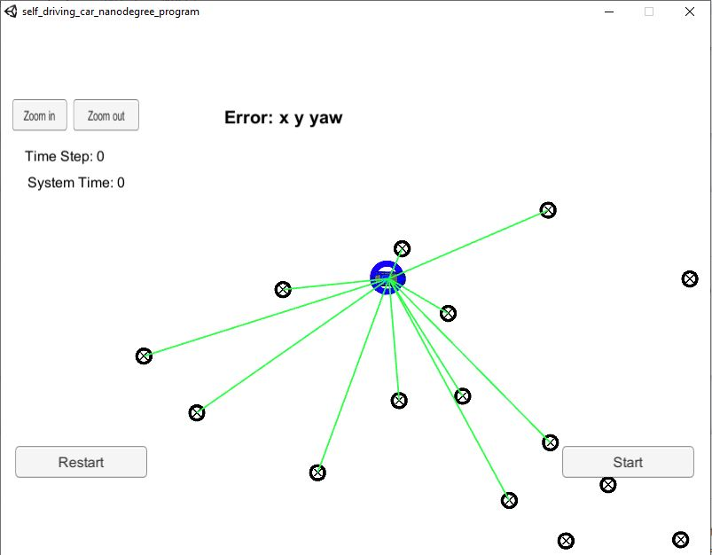
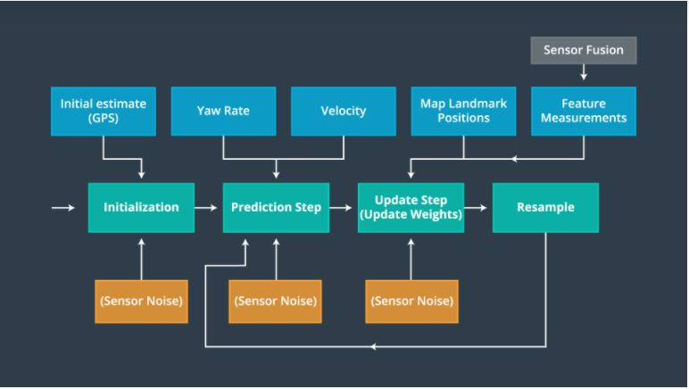
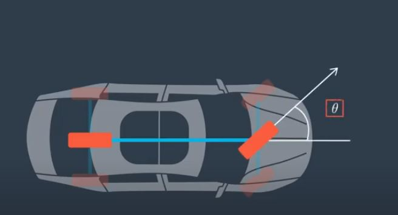
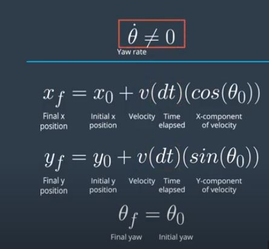
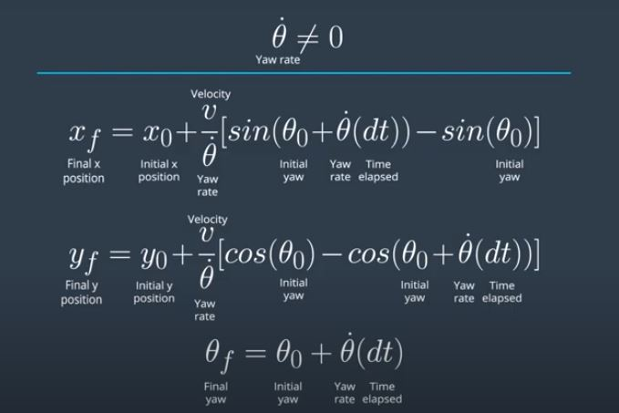
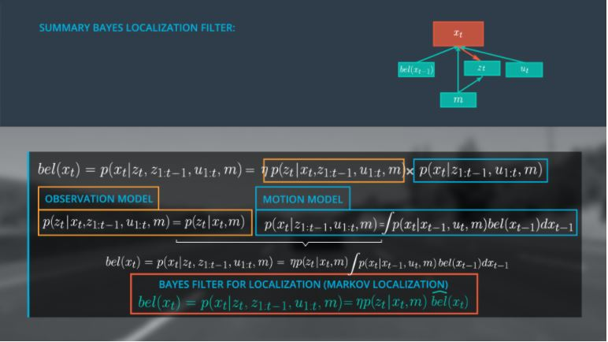
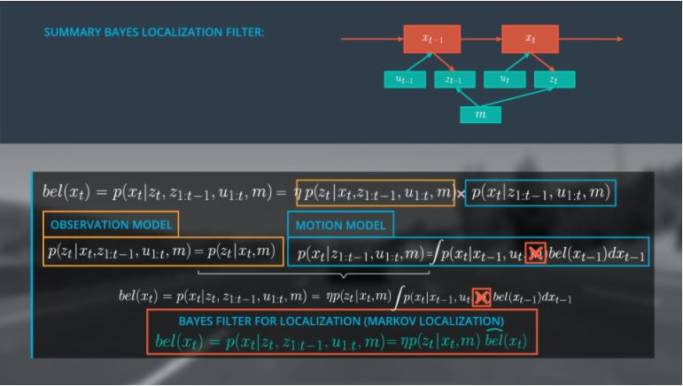
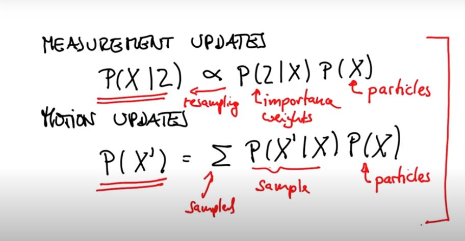
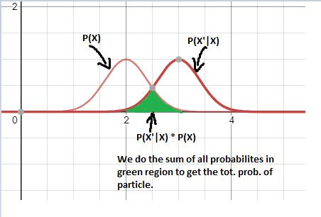

# Kidnapped Vehicle Localization

[](http://www.udacity.com/drive)



<h2> Overview </h2>
<p> The project focusses on solving the kidnapped vehicle problem using the Particle filters approach in a map which contains many poles placed in random locations. The robot is placed with sensors which measures the distance from the robot and the nearest poles with the sensor range. The robot doesn't match any reading with the corresponding poles. It gives the overall observations within the sensor range as input to the filter.We also provide the car's velocity and yaw rate with respect to x axis as the input for prediction step. Initially to get the robot's initial position and orientation we use the GPS measurement with some Gaussian noise as the first input. We use the bicycle motion model to predict the motion of particles as the vehicle moves. The bicycle motion model is the simple approximation of the vehcile,hence it is used.</p>

<h2> Algorithmic overall flow </h2>



<UL>
    <LI> The robot is initialized with the GPS cooridnates. The position and orientation values are initialized with some Gaussian noise </LI>
    <LI> Now the particles are initialized with Normal distribution. The Particles contains 3 values namely the x position, y position and orientation with respect to x.The weights of all the particles are initially set to 1.0 to provide uniform distribution to the inital belief.</LI>
    <LI> Now the prediction step is done. The robot uses the bicycle motion model to estimate the motion of all the particles. The velcoity and yaw rate of the robot is used to the particle next position along with delta t. There is also some noise in the particle movement characterized by the normal distribution. </LI>
    <LI> In particle filter localization problem the map of the environment in which the robot is navigating is previously known. So for the update step we provide the all the landmarks locations of the map, along with pole measurement distance which is obtained from the car's sensors. The weights are being updated with the help of multivariate Gaussian distribution. The weights are further normalized to be taken as probability for the resampling step </LI>
    <LI> Finally the particles with the best match are chosen by the resampling step. We use the resampling wheel approach to do this. These steps will be repeated continuously as the car moves.</LI>
</UL>

<h2> Motion Model </h2>



<p> The bicycle model assumes 2D movement. The two wheels are connected by a rigid beam. It also assumes that the front wheel is alone steerable. Here we assume our car to have both front wheels connected and back wheels as well. They both are connected by rigid beam and the front pair is alson steerable. Thus we are safe to use bicycle motion model for our vehicle. The model assumes constant velocity. </p>

<h3> Equations of bicycle motion model </h3>

<p> The model introduces 2 cases one with Constant turn rate (theta dot = 0 ) and other with Non Constant turn rate (theta dot != 0) </p>




<p> For Each prediction step we use the above equations to update the position and orientation of each of the particles.</p>

<h2> Particle Filters - Intuition </h2>

<p> The Particle filters uses the essence of the Bayes localization algorithm. The Bayes localization algorithm also uses Markov assumption which states that at a particular time the state of the particle depends only on the previous states and not on the states before that.</p>



<p>Here the belief of a particular position xt given the present observation zt and all the previous observations z1:t-1 along with the map and all the controls u1:t-1 is given by the product of normalization coefficient,observation model and motion model. Based on the Markov assumption, the Observation at particular time zt given current position x1,previous observations z1:t-1,map and all the previous controls u1:t-1 can be best assumed to depend only the present state xt and the map. Applying the Markov assumption to the motion model, the Position of the particle at time t (xt) given all the previous observations z1:t-1,map and all the previous controls u1:t-1 can be best assumed to be dependent on the previous position xt-1,map and the current control ut. This values is multiplied with the prior belief of the corresponding particle and summed over all the locations in the map.This forms a recursive structure. Thus the position of particle at t depends on the prior belief (xt-1),current observation,current control and the map.The Observation of the particle depends on the current position (xt) and the map m.</p>

<h4> Approxmiation for constant map </h4>



<p> For localization problems where the map doesn't change much we asssume the m to be constant and don't consider in the motion model. </p>

<h4> Analogy in Particle filters </h4>



<p> In the Prediction step of the particle which is same as the motion update step in bayes localization, we estimate the current position of the new particle using the motion model with Gaussian noise and the prior position of particles. The P(X'|X) probability of the new random particle is obtained by the motion model which is multiplied with the prior of the particle and sampled from the sum of the probabilities to get the new random particle. </p>



<p> In the Update step of the particle which is same as the measurement update step in the bayes localization, we estimate the position of the new particle given the measurments based on the product of the important weights (P(Z|X) - Probability of obtaining the particular measurment given the corresponding X location) and the prior of the particles which is obtained after the motion update step (prediction step). For more observations based on the bayes localization we assosciate each landmark with the corresponding particle's observation , apply normal distribution and finally  multiply all the observation probabilities. We resample these to obtain the X position of the new particles. The resampling ensures that the particles in the particular location with higher weight (particles which are closer to car) are given more priority.</p>


<h2> Updating Weights </h2>


<p> Consider a particle P at coordinates (4,5) and facing downwards at orientation of 90 degrees. The car is aligned with the map coordinates and maeasures 3 landmarks L1,L2 and L5 with Observations OBS1, OBS2, OBS3. The car's sensors has x coordinates facing along the front and y coordinates along the left of the car. Here the car is aligned such that it matches the map coordinates.</p>
<p>    Since the particle is facing downwards, it is not aligned with the map coordinates. So we need to transform the car's observation based on the particle orientation. Since the particle's x axis is facing downwards, we rotate the car's coordinates by 90 degrees in the clockwise direction. Now to find the location of the landmarks from the particles position (converting the landmarks to map coordinates) we add the particle's position to the rotated coordinates. This gives the landmark estimated by the particle in map coordinates. </p>

<h3> Data assosciation </h3> 

<p> We now associate each transformed observations (landmarks estimated by particle) to the landmarks in the map within the sensor range. We use the nearest neighbour assosciation technique for this. The euclidian distance is used as the measurement technique. </p>

<h3> Updation </h3>

<p> Finally we use multivariate Gaussian distribution to estimate the weights of the particular particle. The mean is taken as the landmark x and y values which is of nearest to the corresponding particle. The weights are then normalized to be used as probability distribution for resampling </p>

<h2> Resampling </h2>


<p> We use the resampling wheel approch to estimate the new particles. The psuedo code is as below. </p>

```
index = Uniform Sampling[1...N] //N particles
Beta = 0

for i= 1..N:
    Beta = Beta + Uniform Sampling(0...2*Wmax) /Wmax = Maximum weight
    while w[index] < beta:
        beta = beta - w[index]
        index = index + 1

    select p[index]
    
```

<h2> Implementation </h2>

```
The simulator can be downloaded in the link (Term 2 Simulator V1.45)
https://github.com/udacity/self-driving-car-sim/releases
Installation of dependencies (uWebsocket)

apt-get install zlib1g-dev
./install-linux.sh (based on linux distribution)

To Run the project.
First Start the simulator for kidnapped vehicle localization project.
Now in terminal in project path

mkdir build
cd build
cmake ..
make
./particle_filter

Now in simulator click start.

```
<h2> Results </h2>


